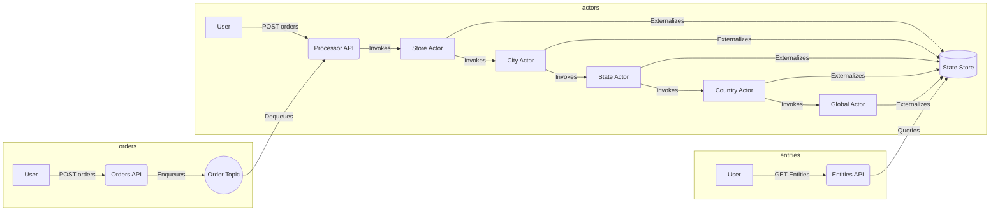

## Init

For local self-hosted:
```
dapr init
```

For kubernetes support:

```
dapr init --kubernetes --wait
```

## Create Solution

```
mkdir store-manager
cd store-manager
```

## Create Projects

```
dotnet new classlib -o shared
dotnet new webapi -o actors-api
dotnet new webapi -o entities-api
dotnet new webapi -o orders-api
dotnet new console -o pumper
```

## Nuget Packages

```
dotnet add package Dapr.AspNetCore
dotnet add package Dapr.Actors
dotnet add package Dapr.Actors.AspNetCore
```

```
dotnet add actors-api/actors-api.csproj reference shared/shared.csproj
```

## Services

| Microservice | Application Port | Dapr sidecar HTTP port | Dapr sidecar gRPC port |
| --- | --- | --- | --- |
| actors-api | 6000 | 3600 | 60000 |
| orders-api | 6001 | 3601 | 60001 |
| entities-api | 6002 | 3602 | 60002 |

## Dashboard

Runs on port 8080:

```
dapr dashboard 
```

## Redis cli

```
npm install -g redis-cli
rdcli -h localhost -a "" -p 6379
KEYS *
HGETALL DaprCounter||counter
del DaprCounter||counter
```
Alternatively, you can access Docker CLI:

```
docker exec -it dapr_redis redis-cli
```

- Clean Redis: 
```
FLUSHALL
```

- Make sure:
```
KEYS *
```

## Docker

Docker files have to be at the roor because they need to include the shared library.

## Kubernetes

```
bash ./start.sh
kubectl get pods -n dapr-storemanager
basg ./stop.sh
```

## Notes
- Improve Mermaid diagram
- ~~How about local K8s?~~
- How about Azure Container Apps?
- Use Azure Bicep to deploy using Github actions
