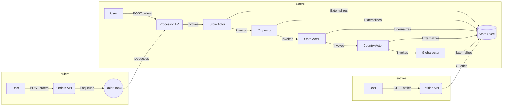

[![](https://mermaid.ink/img/eyJjb2RlIjoiZ3JhcGggTFJcbiAgICBzdWJncmFwaCBvcmRlcnNcbiAgICBBW1VzZXJdIC0tPnxQT1NUIG9yZGVyc3wgQihPcmRlcnMgQVBJKVxuICAgIEIgLS0-IHxFbnF1ZXVlc3wgQygoT3JkZXIgVG9waWMpKSBcbiAgICBlbmRcbiAgICBzdWJncmFwaCBhY3RvcnNcbiAgICBVW1VzZXJdIC0tPnxQT1NUIG9yZGVyc3wgRChPcmRlcnMgQVBJKVxuICAgIEMgLS0-fERlcXVldWVzfCBEKFByb2Nlc3NvciBBUEkpXG4gICAgRCAtLT58SW52b2tlc3wgRVtTdG9yZSBBY3Rvcl1cbiAgICBFIC0tPnxJbnZva2VzfCBGW0NpdHkgQWN0b3JdXG4gICAgRiAtLT58SW52b2tlc3wgR1tTdGF0ZSBBY3Rvcl1cbiAgICBHIC0tPnxJbnZva2VzfCBIW0NvdW50cnkgQWN0b3JdXG4gICAgSCAtLT58SW52b2tlc3wgSVtHbG9iYWwgQWN0b3JdXG4gICAgRSAtLT58RXh0ZXJuYWxpemVzfCBKWyhTdGF0ZSBTdG9yZSldIFxuICAgIEYgLS0-fEV4dGVybmFsaXplc3wgSlsoU3RhdGUgU3RvcmUpXVxuICAgIEcgLS0-fEV4dGVybmFsaXplc3wgSlsoU3RhdGUgU3RvcmUpXVxuICAgIEggLS0-fEV4dGVybmFsaXplc3wgSlsoU3RhdGUgU3RvcmUpXVxuICAgIEkgLS0-fEV4dGVybmFsaXplc3wgSlsoU3RhdGUgU3RvcmUpXSAgICBcbiAgICBlbmRcbiAgICBzdWJncmFwaCBlbnRpdGllc1xuICAgIEtbVXNlcl0gLS0-fEdFVCBFbnRpdGllc3wgTChFbnRpdGllcyBBUEkpXG4gICAgTCAtLT4gfFF1ZXJpZXN8IEpbKFN0YXRlIFN0b3JlKV1cbiAgICBlbmRcbiIsIm1lcm1haWQiOnsidGhlbWUiOiJkZWZhdWx0In0sInVwZGF0ZUVkaXRvciI6ZmFsc2UsImF1dG9TeW5jIjp0cnVlLCJ1cGRhdGVEaWFncmFtIjpmYWxzZX0)](https://mermaid-js.github.io/mermaid-live-editor/edit#eyJjb2RlIjoiZ3JhcGggTFJcbiAgICBzdWJncmFwaCBvcmRlcnNcbiAgICBBW1VzZXJdIC0tPnxQT1NUIG9yZGVyc3wgQihPcmRlcnMgQVBJKVxuICAgIEIgLS0-IHxFbnF1ZXVlc3wgQygoT3JkZXIgVG9waWMpKSBcbiAgICBlbmRcbiAgICBzdWJncmFwaCBhY3RvcnNcbiAgICBVW1VzZXJdIC0tPnxQT1NUIG9yZGVyc3wgRChPcmRlcnMgQVBJKVxuICAgIEMgLS0-fERlcXVldWVzfCBEKFByb2Nlc3NvciBBUEkpXG4gICAgRCAtLT58SW52b2tlc3wgRVtTdG9yZSBBY3Rvcl1cbiAgICBFIC0tPnxJbnZva2VzfCBGW0NpdHkgQWN0b3JdXG4gICAgRiAtLT58SW52b2tlc3wgR1tTdGF0ZSBBY3Rvcl1cbiAgICBHIC0tPnxJbnZva2VzfCBIW0NvdW50cnkgQWN0b3JdXG4gICAgSCAtLT58SW52b2tlc3wgSVtHbG9iYWwgQWN0b3JdXG4gICAgRSAtLT58RXh0ZXJuYWxpemVzfCBKWyhTdGF0ZSBTdG9yZSldIFxuICAgIEYgLS0-fEV4dGVybmFsaXplc3wgSlsoU3RhdGUgU3RvcmUpXVxuICAgIEcgLS0-fEV4dGVybmFsaXplc3wgSlsoU3RhdGUgU3RvcmUpXVxuICAgIEggLS0-fEV4dGVybmFsaXplc3wgSlsoU3RhdGUgU3RvcmUpXVxuICAgIEkgLS0-fEV4dGVybmFsaXplc3wgSlsoU3RhdGUgU3RvcmUpXSAgICBcbiAgICBlbmRcbiAgICBzdWJncmFwaCBlbnRpdGllc1xuICAgIEtbVXNlcl0gLS0-fEdFVCBFbnRpdGllc3wgTChFbnRpdGllcyBBUEkpXG4gICAgTCAtLT4gfFF1ZXJpZXN8IEpbKFN0YXRlIFN0b3JlKV1cbiAgICBlbmRcbiIsIm1lcm1haWQiOiJ7XG4gIFwidGhlbWVcIjogXCJkZWZhdWx0XCJcbn0iLCJ1cGRhdGVFZGl0b3IiOmZhbHNlLCJhdXRvU3luYyI6dHJ1ZSwidXBkYXRlRGlhZ3JhbSI6ZmFsc2V9)

## Init

For local self-hosted:
```
dapr init
```

For kubernetes support:

```
dapr init --kubernetes --wait
```

## Create Solution

```
mkdir store-manager
cd store-manager
```

## Create Projects

```
dotnet new classlib -o shared
dotnet new webapi -o actors-api
dotnet new webapi -o entities-api
dotnet new webapi -o orders-api
dotnet new console -o pumper
```

## Nuget Packages

```
dotnet add package Dapr.AspNetCore
dotnet add package Dapr.Actors
dotnet add package Dapr.Actors.AspNetCore
```

```
dotnet add actors-api/actors-api.csproj reference shared/shared.csproj
```

```
dotnet add package Radzen.Blazor
```

## Services

| Microservice | Application Port | Dapr sidecar HTTP port | Dapr sidecar gRPC port |
| --- | --- | --- | --- |
| actors-api | 6000 | 3600 | 60000 |
| orders-api | 6001 | 3601 | 60001 |
| entities-api | 6002 | 3602 | 60002 |

## Dashboard

Runs on port 8080:

```
dapr dashboard 
```

## Redis cli

```
npm install -g redis-cli
rdcli -h localhost -a "" -p 6379
KEYS *
HGETALL DaprCounter||counter
del DaprCounter||counter
```
Alternatively, you can access Docker CLI:

```
docker exec -it dapr_redis redis-cli
```

- Clean Redis: 
```
FLUSHALL
```

- Make sure:
```
KEYS *
```

If funning in k8s, do `docker ps` to discover the container name of the REDIS running in K8s. and then do the above docker command:

```bash
docker exec -it k8s_redis_redis-75db659ddc-q6jfn_dapr-storemanager_b116ad62-7b4e-4a75-968f-39f84ce8a16c_0 redis-cli
```


## Docker

Docker files have to be at the roor because they need to include the shared library.

```bash
docker image build -t store-manager/entities:1.0 . -f Dockerfile-entities
docker container run -it  -p 6002:6002 store-manager/entities:1.0
docker inspect <container-id>
```

Make sure the ASP.Net core project run using `0.0.0.0` as opposed to `localhost`. Otherwise the error is `socket hang` whikle running in Docker.

## Kubernetes

```bash
bash ./start.sh
kubectl get pods -n dapr-storemanager
basg ./stop.sh
```

## Notes
- Improve Mermaid diagram
- ~~How about local K8s?~~
- How about Azure Container Apps?
- Use Azure Bicep to deploy using Github actions
