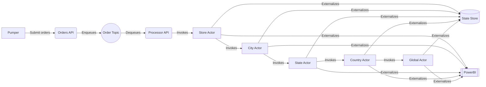

[![](https://mermaid.ink/img/eyJjb2RlIjoiZ3JhcGggTFJcbiAgICBBW1B1bXBlcl0gLS0-fFN1Ym1pdCBvcmRlcnN8IEIoT3JkZXJzIEFQSSlcbiAgICBCIC0tPiB8RW5xdWV1ZXN8IEMoKE9yZGVyIFRvcGljKSlcbiAgICBDIC0tPnxEZXF1ZXVlc3wgRChQcm9jZXNzb3IgQVBJKVxuICAgIEQgLS0-fEludm9rZXN8IEVbU3RvcmUgQWN0b3JdXG4gICAgRSAtLT58SW52b2tlc3wgRltDaXR5IEFjdG9yXVxuICAgIEYgLS0-fEludm9rZXN8IEdbU3RhdGUgQWN0b3JdXG4gICAgRyAtLT58SW52b2tlc3wgSFtDb3VudHJ5IEFjdG9yXVxuICAgIEggLS0-fEludm9rZXN8IElbR2xvYmFsIEFjdG9yXVxuICAgIEUgLS0-fEV4dGVybmFsaXplc3wgSlsoU3RhdGUgU3RvcmUpXSBcbiAgICBGIC0tPnxFeHRlcm5hbGl6ZXN8IEpbKFN0YXRlIFN0b3JlKV1cbiAgICBHIC0tPnxFeHRlcm5hbGl6ZXN8IEpbKFN0YXRlIFN0b3JlKV1cbiAgICBIIC0tPnxFeHRlcm5hbGl6ZXN8IEpbKFN0YXRlIFN0b3JlKV1cbiAgICBJIC0tPnxFeHRlcm5hbGl6ZXN8IEpbKFN0YXRlIFN0b3JlKV0gICAgXG4gICAgRSAtLT58RXh0ZXJuYWxpemVzfCBLW1tQb3dlckJJXV0gXG4gICAgRiAtLT58RXh0ZXJuYWxpemVzfCBLW1tQb3dlckJJXV1cbiAgICBHIC0tPnxFeHRlcm5hbGl6ZXN8IEtbW1Bvd2VyQkldXVxuICAgIEggLS0-fEV4dGVybmFsaXplc3wgS1tbUG93ZXJCSV1dXG4gICAgSSAtLT58RXh0ZXJuYWxpemVzfCBLW1tQb3dlckJJXV0gICAgIiwibWVybWFpZCI6eyJ0aGVtZSI6ImRlZmF1bHQifSwidXBkYXRlRWRpdG9yIjpmYWxzZSwiYXV0b1N5bmMiOnRydWUsInVwZGF0ZURpYWdyYW0iOmZhbHNlfQ)](https://mermaid-js.github.io/mermaid-live-editor/edit#eyJjb2RlIjoiZ3JhcGggTFJcbiAgICBBW1B1bXBlcl0gLS0-fFN1Ym1pdCBvcmRlcnN8IEIoT3JkZXJzIEFQSSlcbiAgICBCIC0tPiB8RW5xdWV1ZXN8IEMoKE9yZGVyIFRvcGljKSlcbiAgICBDIC0tPnxEZXF1ZXVlc3wgRChQcm9jZXNzb3IgQVBJKVxuICAgIEQgLS0-fEludm9rZXN8IEVbU3RvcmUgQWN0b3JdXG4gICAgRSAtLT58SW52b2tlc3wgRltDaXR5IEFjdG9yXVxuICAgIEYgLS0-fEludm9rZXN8IEdbU3RhdGUgQWN0b3JdXG4gICAgRyAtLT58SW52b2tlc3wgSFtDb3VudHJ5IEFjdG9yXVxuICAgIEggLS0-fEludm9rZXN8IElbR2xvYmFsIEFjdG9yXVxuICAgIEUgLS0-fEV4dGVybmFsaXplc3wgSlsoU3RhdGUgU3RvcmUpXSBcbiAgICBGIC0tPnxFeHRlcm5hbGl6ZXN8IEpbKFN0YXRlIFN0b3JlKV1cbiAgICBHIC0tPnxFeHRlcm5hbGl6ZXN8IEpbKFN0YXRlIFN0b3JlKV1cbiAgICBIIC0tPnxFeHRlcm5hbGl6ZXN8IEpbKFN0YXRlIFN0b3JlKV1cbiAgICBJIC0tPnxFeHRlcm5hbGl6ZXN8IEpbKFN0YXRlIFN0b3JlKV0gICAgXG4gICAgRSAtLT58RXh0ZXJuYWxpemVzfCBLW1tQb3dlckJJXV0gXG4gICAgRiAtLT58RXh0ZXJuYWxpemVzfCBLW1tQb3dlckJJXV1cbiAgICBHIC0tPnxFeHRlcm5hbGl6ZXN8IEtbW1Bvd2VyQkldXVxuICAgIEggLS0-fEV4dGVybmFsaXplc3wgS1tbUG93ZXJCSV1dXG4gICAgSSAtLT58RXh0ZXJuYWxpemVzfCBLW1tQb3dlckJJXV0gICAgIiwibWVybWFpZCI6IntcbiAgXCJ0aGVtZVwiOiBcImRlZmF1bHRcIlxufSIsInVwZGF0ZUVkaXRvciI6ZmFsc2UsImF1dG9TeW5jIjp0cnVlLCJ1cGRhdGVEaWFncmFtIjpmYWxzZX0)

## Create Solution

```
mkdir store-manager
cd store-manager
```

## Create Projects

```
dotnet new classlib -o shared
dotnet new webapi -o actors-api
dotnet new webapi -o entities-api
dotnet new webapi -o orders-api
dotnet new console -o pumper
dotnet new console -o seeder
```

There are 5 projects:
- `actors-api`: 

## Nuget Packages

```
dotnet add package Dapr.AspNetCore
dotnet add package Dapr.Actors
dotnet add package Dapr.Actors.AspNetCore
```

```
dotnet add actors-api/actors-api.csproj reference shared/shared.csproj
```

## Services

| Microservice | Application Port | Dapr sidecar HTTP port | Dapr sidecar gRPC port |
| --- | --- | --- | --- |
| actors-api | 6000 | 3600 | 60000 |
| orders-api | 6001 | 3601 | 60001 |
| entities-api | 6002 | 3602 | 60002 |

## Dashboard

Runs on port 8080:

```
dapr dashboard 
```

## Redis cli

```
npm install -g redis-cli
rdcli -h localhost -a "" -p 6379
KEYS *
HGETALL DaprCounter||counter
del DaprCounter||counter
```
Alternatively, you can access Docker CLI:

```
docker exec -it dapr_redis redis-cli
```

## Notes
- Draw Mermaid diagram
- How can state be shared among different services, given that Dapr appends the application name in the key i.e. `myapp||mykey`?
- Randomize pumper ...although it is not very significant
- How about `Tye` with local DAPR?
- How about Azure Container Apps?
- How about local K8s?
- How about local Docker Compose?
